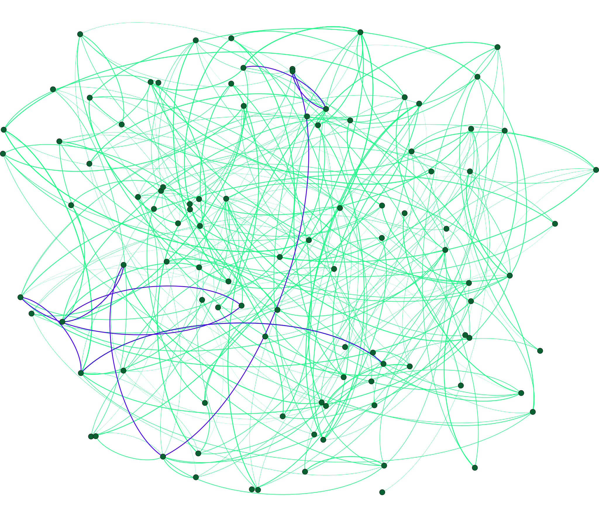
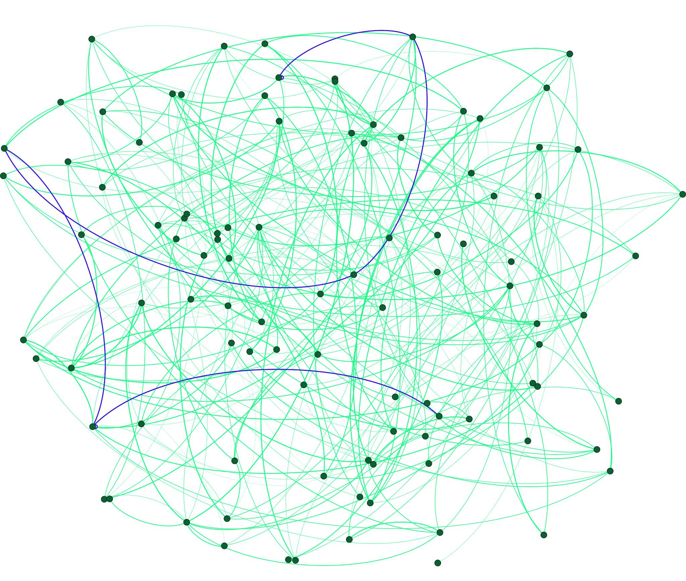

# Genetic Algorithms:

Optimisation problems solved using genetic algorithms in Python. Genetic algorithms are a search heuristic based on natural evolution and natural selection. Using evolutionary processes like mutation, crossover and selection, populations produce offsprings more fit to survive in their environment. Will be updated with visualisation of 
graph problems like TSP/Shortest Path. 

## 1. Shortest Path Simulation
---
Least cost path in a network of nodes can be found using a genetic algorithm, but optimal solution is not guaranteed. The solution below (right image) was obtained over 400 iterations on a 100 node graph with a population size of 30 and 5% mutation rate. The optimal solution is found using Dijkstra's algorithm (left image).
<p align="middle">
  
  
</p>

Run using ```ShortestPathGA/testing.py``` and visualised using [NetworkX](https://networkx.github.io/) and [Gephi](https://gephi.org/). <br>
Optimal shortest path (by Dijkstra) Cost: 1.156  <br>
Genetic Algorithm Cost: 1.562
## Algorithms Completed/In Progress:
---
- [x] Shortest Path Simulation
- [ ] Traveling Salesman Problem

## To do:
---
* GUI visualisation tool
* GA for games

## Usage:
---
1. Run ```pip install requirements.txt```
2. Run ```main()``` in the testing.py files with the required hyperparameters.

